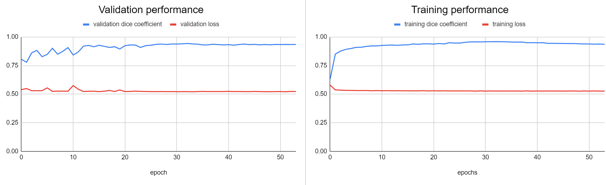

# Fetal_SP_Segmentation


## Table of contents

* [Overview](#overview)
* [Installation](#installation)
* [Dataset](#dataset)
* [Evaluation](#evaluation)
* [Training](#training)
* [Performance](#performance)


## Overview
Deep learning U-Net to predict the subplate (SP), cortical plate (CP) and inner plate segmentation from fetal MRI scans. 


## Installation

This implementation mainly relies on [Python](https://www.python.org/) . The dependencies can installed by running the following code: 
``` bash
python -m venv SP_env
source SP_env/bin/activate
pip install -r requirements.txt
``` 

## Dataset

The model was trained with a dataset of 89 MRI's of subjects between 22 GW and 31 GW. To train the model, the data splits for training/validation/testing are given in ./data/. A gestational age (GA) file is needed that includes the GA of the subjects in alphabetical order. You can find an example in ./data/GA.txt

## Evaluation

The model weights can be downloaded from this [link](https://bit.ly/sp-segmentation-weights). To predict the subplate for an MRI reconstruction using the weights, please run

``` bash
python code/SP_segmentation.py -input evaluation/subj1/recon_to31_nuc.nii -output evaluation/subj1/ -axi ../pretrained/axi.h5 -cor ../pretrained/cor.h5 -sag ../pretrained/sag.h5;
```
Where -input is MRI reconstruction to segment, -output is the path where the segmentation will be saved . Please refer to config.py for detailed configurations.  

## Training 

The following instruction shows how to train the subplate model on a given dataset. 

First, you need to generate the tensorflow (TF) Records, which is a file format used to store the data in binary to be used later on the training code. 
``` bash
nohup python3  code/fetal_subplate_seg_records.py -infol_MR ./data/MR -infol_GT ./data/GT -wl ./tf_records/  -fe 5 -all -sm skf -fi ./data/GA  -gpu 0 -f 5 -bs 30 -fp >tf_records_noatt.out &
```
 Where -infol_MR is the path with the ground truth data, -wl is the path where the TF records will be saved.  Please refer to config.py for detailed configurations.  

 Then, you need to run the following code that trains a U-net network for 100 epochs. 

 ``` bash
nohup python3  code/fetal_subplate_seg.py -infol_MR ./data/MR -infol_GT ./data/GT -infol_rec ./tf_records -wl ./weights/ -hl ./history/ -fe 5 -all -sm skf -fi ./data/GA  -gpu 0 -f 5 -bs 30 -opt SGD -lr 0.0001 -l asymmetric_focal_tversky_loss >weights_noatt.out&
 ```
To visualize the results run the following commands. The first code will show the dice coefficient and losses graphs of the Kfolds, while the second code will show the average dice coefficient and loss of both training and validation. 

``` bash
cd history/
python3 ./results/plots.py . ;
python3 ./results/avg_score2.py . ;
```

## Performance
The model was evaluated using cross-validation. The final training had a training dice coefficient of 0.94 and a training loss of 0.52. The validation dice coefficient was 0.94 with a loss of 0.52


